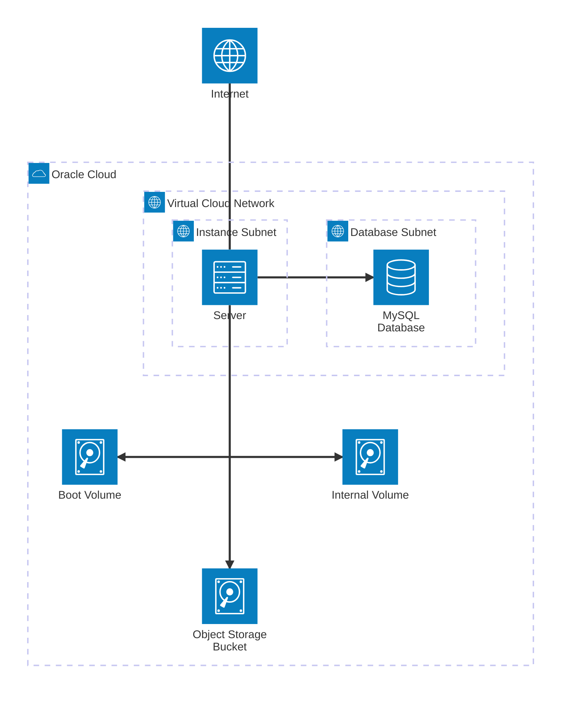

# server

[](LICENSE) [](https://github.com/jeremy-code/server/commit/main)

This repository contains the [Terraform](https://www.terraform.io/) configuration for my server. It is hosted on [Oracle Cloud](https://www.oracle.com/cloud/) and uses [Cloudflare Tunnel](https://developers.cloudflare.com/cloudflare-one/connections/connect-networks/). Currently, it runs the containers [`vaultwarden/server`](https://hub.docker.com/r/vaultwarden/server), [`rclone/rclone`](https://hub.docker.com/r/rclone/rclone), [`docker/busybox`](https://hub.docker.com/_/busybox), [`cloudflare/cloudflared`](https://hub.docker.com/r/cloudflare/cloudflared), and [`linuxserver/foldingathome`](https://docs.linuxserver.io/images/docker-foldingathome/) using [Docker Compose](https://docs.docker.com/compose/).

I have attempted to the best of my ability to make it as secure as possible, but I am not a security expert. I am open to any suggestions for improvement. While I cannot offer any bug bounties, I'm happy to see what I can do to help you out.

The intent is to only deploy ["Always Free"](https://www.oracle.com/cloud/free/) resources offered by Oracle Cloud.

## Usage

```
git clone https://github.com/jeremy-code/server.git
cd server
```

Then, include all variables from [variables.tf](variables.tf) into a `terraform.tfvars` file at the root.

```sh
oci session authenticate --profile-name DEFAULT --region us-phoenix-1
terraform plan "tfplan"
terraform apply -auto-approve "tfplan"
```

## Overview

At a high level, this is what the architecture looks like:



I am using a Canonical [Ubuntu](https://ubuntu.com/) 24.04 LTS (Noble Numbat) server and a [MySQL](https://www.mysql.com/) database system, both in their own subnets. The server has two block volumes attached to it: one for the boot volume and one for the internal volume. It is set up initially with [cloud-init](https://cloud-init.io/) and runs containers using Docker Compose. The server also serves the role of hosting a [WebDAV](http://www.webdav.org/) file server that syncs with a [Oracle Cloud Object Storage](https://www.oracle.com/cloud/storage/object-storage/) bucket. The server also sends email via [Oracle Cloud Infrastructure Email Delivery](https://www.oracle.com/application-development/email-delivery/). The server is finally reversed proxied via Cloudflare Tunnel for Internet access.

### Containers

1. [`vaultwarden/server`](https://hub.docker.com/r/vaultwarden/server)

[Vaultwarden](https://github.com/dani-garcia/vaultwarden) is a Rust-based [Bitwarden](https://bitwarden.com/)-compatible server. Besides being lighter, it is also much less complicated than the official implementation (see [DockerCompose.hbs](https://github.com/bitwarden/server/blob/main/util/Setup/Templates/DockerCompose.hbs) in [bitwarden/server](https://github.com/bitwarden/server/)) and supports the Arm architecture. Security-wise, there have been [audits](https://github.com/dani-garcia/vaultwarden/wiki/Audits) that assuage my concerns, and I have enabled MFA. The data is stored in the aforementioned MySQL database.

2. [`rclone/rclone`](https://github.com/rclone/rclone/tree/master)

[Rclone](https://rclone.org/) is an awesome utility that I use to host a [WebDAV](http://www.webdav.org) file server that syncs with Oracle Cloud Object Storage (aka Oracle's equivalent of AWS S3). I am using it through the official Docker image. I am a big fan of its first-class support for Oracle Cloud since I don't need to store my credentials in my compute instance since it uses [Instance Principals](https://docs.oracle.com/en-us/iaas/Content/Identity/Tasks/callingservicesfrominstances.htm) for authorization (though I do need to set up a policy to allow the instance to access the Object Storage bucket).

3. [`docker/busybox`](https://hub.docker.com/_/busybox)

I am using Docker's official [BusyBox](https://busybox.net/) image to serve a `robots.txt` file with its `httpd` server. This is to prevent bot traffic on my server. I understand this may be unconventional since it also means search engines may index my site, but since all services are behind authentication, I don't think this should leak any sensitive information (and even so, I could merely ask the search engine to remove the page or temporarily allow it before rejecting it again). While it is bizarre to have an entire container exist solely to serve one file, BusyBox is only 1.2 MB; furthermore, if I were to: (1) host it on the server itself, I would have to expose my server to the Internet (2) host it on the WebDAV file server, it may expose sensitive information from the file server.

4. [`cloudflare/cloudflared`](https://hub.docker.com/r/cloudflare/cloudflared)

In my opinion, exposing a server to the Internet is evil. Using [Cloudflare Tunnel](https://developers.cloudflare.com/cloudflare-one/connections/connect-networks/), I can delegate this evil to Cloudflare. I found some caveats while dockerizing it, see ["Cloudflare Tunnel"](#cloudflare-tunnel) in [Miscellaneous Notes](https://github.com/jeremy-code/server#miscellaneous-notes) for more information.

5. [`linuxserver/foldingathome`](https://docs.linuxserver.io/images/docker-foldingathome/)

While [Folding@home](https://foldingathome.org/) does have an official Docker image ([`foldingathome/fah-gpu`](https://hub.docker.com/r/foldingathome/fah-gpu)), it does not support ARM64 and (as of March 2025) has not been updated in three years. [LinuxServer.io](https://www.linuxserver.io/) has a much more recent image using the newly rewritten v8 _Bastet_ Folding@home client ([app.foldingathome.org](https://app.foldingathome.org)).

## Miscellaneous Notes

### Oracle Cloud

- After the MySQL database is created for the first time, run the SQL command `CREATE DATABASE vaultwarden;`. I have not figured out a satisfying way to automate this yet.
- ~~Oracle Cloud [Custom Logs](https://docs.oracle.com/en-us/iaas/Content/Logging/Concepts/custom_logs.htm) are not supported on Canonical Ubuntu 24.04 even when `oracle-cloud-agent` is installed, despite being supported on its predecessor Ubuntu 20.04 (See [Viewing Custom Logs in a Compute Instance](https://docs.oracle.com/en-us/iaas/Content/Logging/Concepts/viewing_custom_logs_in_a_compute_instance.htm)).~~
  - I believe I have confused "Oracle Cloud Agent" and "Oracle Unified Monitoring Agent". I am still not certain if Ubuntu 24.04 is supported, see [Agent Management Overview](https://docs.oracle.com/en-us/iaas/Content/Logging/Concepts/agent_management.htm) which only lists up to Ubuntu 22.04. Since the installation seems fairly involved including setting up the [OCI CLI](https://docs.oracle.com/en-us/iaas/Content/API/SDKDocs/climanualinst.htm#Manual_Installation), I have yet to explore this option.
- While Oracle Linux seems to be in general more useful on Oracle Cloud, [`cloud-init`](https://cloud-init.io/) (which itself is maintained by [Canonical](https://canonical.com/)) seems to have much better Ubuntu support. For example, it does not currently support [`dnf`](https://rpm-software-management.github.io/) (though it does support [`yum`](http://yum.baseurl.org/)).
- I am using a MySQL database for Vaultwarden rather than a block volume with an SQLite file because (1) Using a MySQL database frees up 50 GB of block storage and (2) Whenever Terraform destroys the instance, the attached block volume is also destroyed. While this may be rectified manually by detaching the block volume, using a MySQL database guarantees the instance and the database are decoupled.
  - I highly recommend having off-site backups of the MySQL database in case Oracle Cloud closes your account or something else catastrophic happens.
- Many of the security features Oracle Cloud offers are not available on the "Always Free" tier, such as [NAT Gateways](https://docs.oracle.com/iaas/Content/Network/Tasks/NATgateway.htm), ~~Web Application Firewalls~~, [Service Gateways](https://www.oracle.com/cloud/networking/service-gateway/), and [Capture Filters](https://docs.oracle.com/en-us/iaas/Content/Network/Concepts/capture-filters.htm) (and by extension, [VCN Flow Logs](https://docs.oracle.com/en-us/iaas/Content/Network/Concepts/vcn-flow-logs.htm)).
  - I believe I have confused [Network Firewalls](https://www.oracle.com/cloud/networking/network-firewall/) and [Web Application Firewalls](https://www.oracle.com/security/cloud-security/web-application-firewall/), the former being free for the first 10 TiB of traffic per month. I have yet to explore this option. The latter appears geared towards web applications.
- I am using iSCSI to attach a block volume to the instance due to the overhead of using a paravirtualized device. However, since this requires a connection to the target, I am using the Snap package `oracle-cloud-agent` to handle this automatically. The issue is that while cloud-init allows configuration of disks, partitions, and mounts, this occurs in the "init stage" while package installation occurs later in the "final stage". Installing the Snap package early during the boot command configuration led to some bizarre behavior (`snapd` is not installed by default on this image). Unfortunately, this means I cannot mount the block volume with cloud-init, and instead, once I have access to the volume, I run a command to create an `ext3` filesystem on the disk (if it does not exist) and then mount it.
- Since Email Delivery is "Always Free" for up to 100 emails sent per day, which is more than enough for my needs, I have opted to use [Oracle Cloud Infrastructure Email Delivery](https://www.oracle.com/application-development/email-delivery/) rather than a third-party service like [SendGrid](https://sendgrid.com/) or [Mailgun](https://www.mailgun.com/) just to keep everything on the same platform.
  - One slight I have against Oracle's service is that there are only two options for sending emails: sending an authenticated HTTPS request or using the SMTP credentials of a user. Since most services I am working with require SMTP for anything email-related, I have opted to use the SMTP credentials, which has some security implications. I would prefer if there was some way to have an instance authenticate to an SMTP server, but I don't believe this is possible.

### Vaultwarden

- Set `SIGNUPS_ALLOWED` to `true` temporarily when creating the first user, then set it back to `false`.
- Ensure multi-factor authentication is enabled in Vaultwarden.
- ~~The MySQL database password is stored in plain text at `/home/jeremy/docker-compose.yml` on the Compute instance. This is not ideal. I have not found a way to securely store it yet. To my knowledge, the best solution can be found here: [Using Docker Secrets with a VaultWarden / MySQL Setup](https://anujnair.com/blog/19-using-docker-secrets-with-a-vaultwarden-mysql-setup) by [Anuj Nair](https://github.com/AnujRNair/) using a shell script to set the environment variable. Ideally, I hope there will be an option to set a `DATABASE_URL_FILE` in Vaultwarden sometime in the future.~~
  - It appears that Vaultwarden can read any file listed as `${ENV_FILE}` where `ENV` is an environment variable setting. You can see this in the Vaultwarden source code here [vaultwarden/src/util.rs](https://github.com/dani-garcia/vaultwarden/blob/main/src/util.rs#L378). This appears to have been introduced in this commit dani-garcia/vaultwarden@e8ef76b8f928c8898bcd84c819d616094f123f21. Hence, I have updated the `docker-compose.yml` file to use a secret for the MySQL database URL.

### Rclone

- I am a MacOS user, hence I wanted a light (e.g. no excessive UI frontend) solution compatible with MacOS. Per [Apple: Servers and shared computers you can connect to on Mac](https://support.apple.com/guide/mac-help/servers-shared-computers-connect-mac-mchlp3015/mac), the protocols supported by MacOS are SMB/CIFS, NFS, WebDAV (FTP is also supported for only read-access). Hence, since WebDAV is the only protocol that supports HTTP (for compatability with Cloudflare Tunnel without requiring a VPN or a direct connection), it was the obvious choice. However, iOS's Files app does not support WebDAV natively.
- I am using the `rclone serve webdav` command to serve a WebDAV file server. For some reason, setting `--addr rclone:9800` fixes any connection issues I have. I am not certain why since the documentation claims it should be used for IP addresses, but it works -- whether it is a bug or an undocumented feature, I am not sure.
- I am currently using Basic HTTP authentication with a `bcrypt`-hashed (cost of 9) password. I am not certain of the security implications of this, since the server is behind a Cloudflare Tunnel which does encrypt connections from user to the connector. However, I am not certain of a better solution, as using a Cloudflare login page wouldn't work with a file server.

### Folding@home

- You may be skeptical of running Folding@home on a cloud instance, but I have been running a similar setup since 2022 without issue. While Oracle Cloud's Acceptable Use Policy forbids "cyber currency or crypto currency mining", I could not find any mention of distributed computing projects like Folding@home. Furthermore, this official blog post ["How to deploy Folding@home in Oracle Cloud Infrastructure"](https://blogs.oracle.com/cloud-infrastructure/post/how-to-deploy-foldinghome-in-oracle-cloud-infrastructure) and this Oracle image ["FoldingATHome GPU Image"](https://cloudmarketplace.oracle.com/marketplace/en_US/adf.task-flow?tabName=O&adf.tfDoc=%2FWEB-INF%2Ftaskflow%2Fadhtf.xml&application_id=73275127&adf.tfId=adhtf) suggest it is at the very least tacitly endorsed by Oracle.
- ~~I intend to run this as a headless setup. However, this seems much more difficult in version 8 of the client than in version 7, where you could configure `web-enable`, `disable-viz`, and `gui-enable` in `config.xml`.~~
  - I was for some reason under the impression that the client had a GUI. However, I learned that on `http://localhost:7396`, it merely redirects with status code [307 Temporary Redirect](https://developer.mozilla.org/en-US/docs/Web/HTTP/Reference/Status/307) to [app.foldingathome.org](https://app.foldingathome.org/). I suspect that is why those options were removed.

### Cloudflare Tunnel

- Login to [`one.dash.cloudflare.com`](https://one.dash.cloudflare.com), proceed to Networks > Tunnels, click the "Create a tunnel" button, and select "Cloudflared". You should be given a command to run similar to `sudo cloudflared service install [TOKEN]` where `[TOKEN]` is a Base64-encoded JSON object. Run the command `base64 --decode <<< "[TOKEN]"`, which should return a JSON object with properties `a`, `t`, `s`. These correspond to `AccountTag`, `TunnelId`, and `TunnelSecret`, respectively. Add these to `terraform.tfvars`.
- It seems that Cloudflare Tunnel is deprioritizing "locally-managed tunnels" (i.e. using `--cred-file` to configure tunnels). See these comments made by Cloudflare employees on GitHub: [cloudflare/cloudflared#1029](https://github.com/cloudflare/cloudflared/issues/1029#issuecomment-1713537876) and [cloudflare/cloudflare-docs#13099](https://github.com/cloudflare/cloudflare-docs/issues/13099#issuecomment-2136204057). This is also mentioned in the [Cloudflare Tunnel documentation](https://developers.cloudflare.com/cloudflare-one/connections/connect-networks/do-more-with-tunnels/local-management/) where it is stated that "Cloudflare recommends setting up a remotely-managed tunnel." One issue that arises is that remote configuration will always override local configuration (see cloudflare/cloudflared#843). Since I dislike the idea of hard-coding a token to `docker-compose.yml`, I have opted to use `--cred-file` and Docker secrets. I also prefer using a configuration file for predictable behavior, though if it leads to issues, I may switch to using the [Cloudflare provider on Terraform](https://registry.terraform.io/providers/cloudflare/cloudflare/latest/docs).
- When debugging, I continually received the error `Incoming request ended abruptly: context canceled` (see cloudflare/cloudflared#1360). This seems to be a generic error that simply indicates the connection was closed. In my case, it was because the encoded Base64 string and the format for `--cred-file` for some reason differ.
- By default, the base directory is `/user/nonroot`. If you set the user to `root`, the base directory is then set to `/root`.
- The error `failed to sufficiently increase receive buffer size` is a red herring and Tunnels will work despite it. More information see [Cloudflare Tunnel > Troubleshoot tunnels > Common Errors](https://developers.cloudflare.com/cloudflare-one/connections/connect-networks/troubleshoot-tunnels/common-errors/#i-see-failed-to-sufficiently-increase-receive-buffer-size-in-my-cloudflared-logs), cloudflare/cloudflared#1176, [quic-go/quic-go/wiki/UDP-Buffer-Sizes](https://github.com/quic-go/quic-go/wiki/UDP-Buffer-Sizes), and quic-go/quic-go#3418.
  - Furthermore, setting `net.core.rmem_max` and `net.core.wmem_max` seems to not be possible in Docker Compose using the `sysctl` key, which I believe is because the kernel option is not namespaced (moby/moby#30778).
- The default UID and GID for the `nonroot` user is 65532:65532, which originates from the Docker image [distroless](https://github.com/GoogleContainerTools/distroless).

## License

This project is licensed under the [MIT license](LICENSE).
