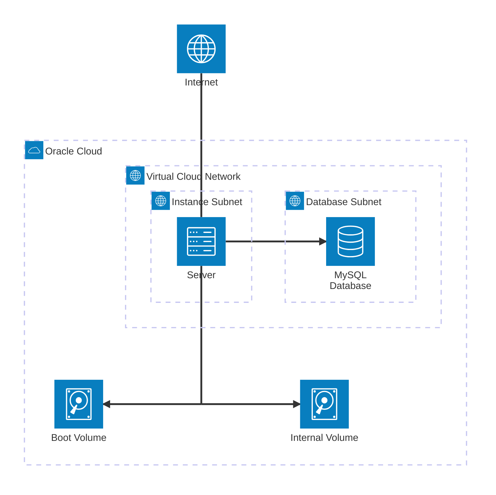

# server

This repository contains the [Terraform](https://www.terraform.io/) configuration for my server. It is hosted on [Oracle Cloud](https://www.oracle.com/cloud/) and uses [Cloudflare Tunnel](https://developers.cloudflare.com/cloudflare-one/connections/connect-networks/). Currently, using [Docker Compose](https://docs.docker.com/compose/), it runs the containers [`vaultwarden/server`](https://hub.docker.com/r/vaultwarden/server), [`linuxserver/foldingathome`](https://docs.linuxserver.io/images/docker-foldingathome/), and [`cloudflare/cloudflared`](https://hub.docker.com/r/cloudflare/cloudflared).

I have attempted to the best of my ability to make it as secure as possible, but I am not a security expert. I am open to any suggestions for improvement. While I cannot offer any bug bounties, I'm happy to see what I can do to help you out.

The intent is to only deploy ["Always Free"](https://www.oracle.com/cloud/free/) resources offered by [Oracle Cloud](https://www.oracle.com/cloud/).

## Usage

```sh
oci session authenticate --profile-name DEFAULT --region us-phoenix-1
terraform plan "tfplan"
terraform apply -auto-approve "tfplan"
```

## Overview

At a high-level, this is what the architecture looks like:



I am using a Canonical Ubuntu 24.04 server and a MySQL database, both in their own subnets. The server has two block volumes attached to it: one for the boot volume and one for the internal volume. It is set up initially with [cloud-init](https://cloud-init.io/) and runs containers using Docker Compose. The server is exposed to the internet via Cloudflare Tunnel.

### Containers

1. [`vaultwarden/server`](https://hub.docker.com/r/vaultwarden/server)

[Vaultwarden](https://github.com/dani-garcia/vaultwarden) is a Rust-based [Bitwarden](https://bitwarden.com/)-compatible server. Besides being lighter, it is also much less complicated than the official implementation (see [DockerCompose.hbs](https://github.com/bitwarden/server/blob/main/util/Setup/Templates/DockerCompose.hbs)) and supports ARM. Security-wise, there have been [audits](https://github.com/dani-garcia/vaultwarden/wiki/Audits) that assuage my concerns.

2. [`linuxserver/foldingathome`](https://docs.linuxserver.io/images/docker-foldingathome/)

While [Folding@home](https://foldingathome.org/) does have an official Docker image ([`foldingathome/fah-gpu`](https://hub.docker.com/r/foldingathome/fah-gpu)), it does not support ARM64 and has not been updated in three years. [LinuxServer.io](https://www.linuxserver.io/) has a much more recent image using the newly rewritten v8 _Bastet_ Folding@home client ([v8-4.foldingathome.org](https://v8-4.foldingathome.org)).

3. [`cloudflare/cloudflared`](https://hub.docker.com/r/cloudflare/cloudflared)

In my opinion, exposing a server to the internet is evil. Using [Cloudflare Tunnel](https://developers.cloudflare.com/cloudflare-one/connections/connect-networks/), I can delegate this evil to Cloudflare.

## Misc. Notes

1. After MySQL database is created for the first time, run the SQL command `CREATE DATABASE vaultwarden;`. I have not figured out a satisfying way to automate this yet.
2. Set `SIGNUPS_ALLOWED` to `true` temporarily when creating the first user, then set it back to `false`.
3. Ensure MFA is enabled in Vaultwarden.
4. Login to `https://one.dash.cloudflare.com`, proceed to Networks > Tunnels, click the "Create a tunnel" button, and select "Cloudflared". You should be given a command to run similar to `sudo cloudflared service install [TOKEN]` where `[TOKEN]` is a base64-encoded JSON object. Run the command `base64 --decode <<< "[TOKEN]"`, which should return a JSON object with properties `a`, `t`, `s`. These correspond to `AccountTag`, `TunnelId` and `TunnelSecret`, respectively. Add these to `terraform.tfvars`.
5. Oracle Cloud [Custom Logs](https://docs.oracle.com/en-us/iaas/Content/Logging/Concepts/custom_logs.htm) are not supported on Canonical Ubuntu 24.04, even if `oracle-cloud-agent` is installed, despite being supported on the earlier Ubuntu 20.04. See [Viewing Custom Logs in a Compute Instance](https://docs.oracle.com/en-us/iaas/Content/Logging/Concepts/viewing_custom_logs_in_a_compute_instance.htm).
6. The MySQL database password is stored in plain text at `/home/ubuntu/docker-compose.yml` on the Compute instance. This is not ideal.
7. While Oracle Linux seems to be in general more useful on Oracle Cloud, [`cloud-init`](https://cloud-init.io/) (which is maintained by Canonical) seems to have much better Ubuntu support. For example, it does not currently support `dnf` (though it does support `yum`).
8. You may be skeptical of running Folding@home on a cloud instance, but I have been running a similar setup since 2022 without issue. While Oracle Cloud's Acceptable Use Policy forbids "cyber currency or crypto currency mining", I could not find any mention of distributed computing projects like Folding@home. Furthermore, this official blog post ["How to deploy Folding@home in Oracle Cloud Infrastructure"](https://blogs.oracle.com/cloud-infrastructure/post/how-to-deploy-foldinghome-in-oracle-cloud-infrastructure) and this Oracle image ["FoldingATHome GPU Image"](https://cloudmarketplace.oracle.com/marketplace/en_US/adf.task-flow?tabName=O&adf.tfDoc=%2FWEB-INF%2Ftaskflow%2Fadhtf.xml&application_id=73275127&adf.tfId=adhtf) suggest it is at the very least tacitly endorsed by Oracle.
9. I am using a MySQL database rather than a block volume with a SQLite file because (1) Using MySQL database frees up 50 GB (2) Whenever Terraform destroys the instance, the attached block volume is also destroyed. While this may be rectified manually by detaching the block volume, using a MySQL database ensures the instance and the database are decoupled.
   - I highly recommended having off-site backups of the MySQL database in case Oracle Cloud closes your account or something else catastrophic happens.
10. Many of the security features Oracle Cloud offers are not available on the "Always Free" tier. For example, NAT Gateways, Web Application Firewalls, Service Gateways, and Capture Filters (and by extension, VCN Flow Logs) cannot be created on the "Always Free" tier.

## License

This project is licensed under the [MIT license](LICENSE).
